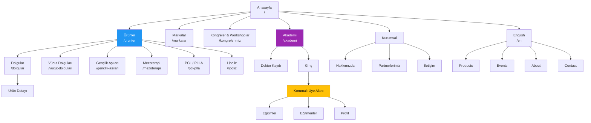

# Anka West Site Architecture

**Version:** v1  
**Updated:** 2026-08-28  
**Status:** İlk uygulama planı; ürün envanteri, hukuki sayfalar ve redirect hedefleri yayın öncesi doğrulanacaktır.

## Architecture Principles

1. Türkçe, ana sitenin varsayılan dilidir ve mevcut değerli URL'ler dil prefix'i olmadan korunur.
2. İngilizce kurumsal ve katalog içeriği `/en` altında yer alır.
3. Akademi ilk sürümde yalnızca Türkçedir. İngilizce eş sayfa üretilmez.
4. Herkese açık Akademi tanıtım/başvuru sayfaları ile yalnızca onaylı doktorların eriştiği eğitim alanı ayrılır.
5. Admin, doğrulama durumu ve üyelere özel eğitim URL'leri arama motorlarına kapalıdır.
6. Skincare ürünleri bu bilgi mimarisine eklenmez; ayrı siteye ürün bazında yönlendirilir.
7. Mevcut Türkçe ürün kategori ve detay URL'leri, gereksiz SEO göçü yaratmamak için korunur.
8. İki frontend paralel geliştirilir; Anka West Skincare önce yayına alınır. Ana site yayına geldiğinde bütün Skincare redirect hedefleri zaten canlı ve doğrulanmış olmalıdır.

## Page Hierarchy

```text
Anasayfa (/)
├── Ürünler (/urunler)
│   ├── Dolgular (/dolgular)
│   │   └── [Ürün] (/dolgular/{product-slug})
│   ├── Vücut Dolguları (/vucut-dolgulari)
│   │   └── [Ürün] (/vucut-dolgulari/{product-slug})
│   ├── Gençlik Aşıları (/genclik-asilari)
│   │   └── [Ürün] (/genclik-asilari/{product-slug})
│   ├── Mezoterapi (/mezoterapi)
│   │   └── [Ürün] (/mezoterapi/{product-slug})
│   ├── PCL / PLLA (/pcl-plla)
│   │   └── [Ürün] (/pcl-plla/{product-slug})
│   └── Lipoliz (/lipoliz)
│       └── [Ürün] (/lipoliz/{product-slug})
├── Markalarımız (/markalar)
│   └── [Marka] (/markalar/{brand-slug})
├── Kongreler & Workshoplar (/kongrelerimiz)
│   └── [Etkinlik] (/kongrelerimiz/{event-slug})
├── Akademi (/akademi) [herkese açık tanıtım]
│   ├── Doktor Kaydı (/akademi/kayit) [noindex]
│   ├── Giriş (/akademi/giris) [noindex]
│   ├── E-posta Doğrulama (/akademi/e-posta-dogrulama) [noindex]
│   ├── Başvuru Durumu (/akademi/basvuru-durumu) [noindex]
│   └── Üye Alanı [onaylı doktor + noindex]
│       ├── Eğitimler (/akademi/egitimler)
│       │   └── [Eğitim] (/akademi/egitimler/{education-slug})
│       ├── Eğitmenler (/akademi/egitmenler)
│       │   └── [Eğitmen] (/akademi/egitmenler/{instructor-slug})
│       └── Profil (/akademi/profil)
├── Hakkımızda (/hakkimizda)
├── Partnerlerimiz (/partnerlerimiz)
├── İletişim ve Talep Formu (/contact)
├── English (/en)
│   ├── Products (/en/products)
│   │   ├── Fillers (/en/products/fillers)
│   │   │   └── [Product] (/en/products/fillers/{product-slug})
│   │   ├── Body Fillers (/en/products/body-fillers)
│   │   ├── Skin Boosters (/en/products/skin-boosters)
│   │   ├── Mesotherapy (/en/products/mesotherapy)
│   │   ├── PCL / PLLA (/en/products/pcl-plla)
│   │   └── Lipolysis (/en/products/lipolysis)
│   ├── Brands (/en/brands)
│   │   └── [Brand] (/en/brands/{brand-slug})
│   ├── Congresses & Workshops (/en/events)
│   │   └── [Event] (/en/events/{event-slug})
│   ├── About (/en/about)
│   ├── Partners (/en/partners)
│   └── Contact (/en/contact)
├── Gizlilik Politikası (/gizlilik-politikasi)
├── KVKK Aydınlatma Metni (/kvkk-aydinlatma-metni)
├── Çerez Politikası (/cerez-politikasi)
├── Kullanım Koşulları (/kullanim-kosullari)
└── Akademi Üyelik Koşulları (/akademi/uyelik-kosullari)

Yönetim Alanı (/admin) [navigasyonda yok + noindex]
├── İçerik ve Katalog
├── Kongre / Workshop
├── Partner ve Marka
└── Akademi
    ├── Doktor Başvuruları
    ├── Eğitimler ve Videolar
    └── Eğitmen Kayıtları
```

Türkçe ürün kategorilerinin `/urunler/{kategori}` altında olmaması bilinçli bir legacy SEO istisnasıdır. Bilgi mimarisinde Ürünler'in altında kalırlar; breadcrumb ve kategori navigasyonu `/urunler` hub'ına bağlanır.

## Visual Sitemap



## URL Map

| Page type | Turkish URL | English alternate | Parent | Nav location | Priority | Indexing |
| --- | --- | --- | --- | --- | --- | --- |
| Homepage | `/` | `/en` | — | Logo | Critical | Index |
| Product hub | `/urunler` | `/en/products` | Homepage | Header | Critical | Index |
| Product category | Legacy paths such as `/dolgular` | `/en/products/{category}` | Products | Header dropdown | High | Index |
| Product detail | `/{category}/{product-slug}` | `/en/products/{category}/{product-slug}` | Category | Contextual | High | Index |
| Brands hub | `/markalar` | `/en/brands` | Homepage | Header | High | Index |
| Brand detail | `/markalar/{brand-slug}` | `/en/brands/{brand-slug}` | Brands | Contextual | Medium | Index |
| Events hub | `/kongrelerimiz` | `/en/events` | Homepage | Header | High | Index |
| Event detail | `/kongrelerimiz/{event-slug}` | `/en/events/{event-slug}` | Events | Contextual | Medium | Index |
| Academy landing | `/akademi` | — | Homepage | Header | Critical | Index |
| Academy registration | `/akademi/kayit` | — | Academy | Academy CTA | High | Noindex |
| Academy login | `/akademi/giris` | — | Academy | Header utility | High | Noindex |
| Academy member pages | `/akademi/**` | — | Academy | Member nav | High | Noindex + auth |
| About | `/hakkimizda` | `/en/about` | Homepage | Header/Footer | Medium | Index |
| Partners | `/partnerlerimiz` | `/en/partners` | About | Footer/Contextual | Medium | Index |
| Contact | `/contact` | `/en/contact` | Homepage | Header CTA | Critical | Index |
| Legal pages | Turkish slugs | English pages only if approved copy exists | Homepage | Footer | Required | Index unless counsel says otherwise |
| Admin | `/admin/**` | — | — | None | Internal | Noindex + auth + mandatory 2FA |

## Navigation Specification

### Public Header

Ordered desktop navigation:

1. Ürünler — category dropdown; category names are descriptive links.
2. Markalarımız.
3. Kongreler & Workshoplar.
4. Akademi.
5. Hakkımızda — Partnerlerimiz can appear in its small dropdown.
6. `İletişime Geç` — rightmost primary CTA to `/contact`.

Utilities: language switch (`TR` / `EN`) and, on Turkish pages, `Akademi Girişi`. Logo always links to the current language homepage. Mobile navigation uses a labelled button, an accordion for product categories and a visible contact CTA.

The English header contains no English Academy clone. It may link to `/akademi` with a clear `TR` language label.

### Academy Member Navigation

- Eğitimler
- Eğitmenler
- Profil
- Güvenli çıkış

Member navigation must not expose admin links. Pending, rejected or suspended users cannot reach member routes even when they know the URL.

### Footer

- **Ürünler:** category links and `/urunler`.
- **Kurumsal:** Hakkımızda, Markalarımız, Kongreler & Workshoplar, Partnerlerimiz.
- **Akademi:** Akademi Hakkında, Doktor Kaydı, Giriş, Üyelik Koşulları.
- **İletişim:** address, approved phone/e-mail and contact page.
- **Yasal:** Privacy, KVKK, cookies and terms.
- **Other brand:** Anka West Skincare external link once its final domain is approved.

### Breadcrumbs

Use visible breadcrumbs and `BreadcrumbList` JSON-LD on public detail pages:

- `Anasayfa > Ürünler > Dolgular > Yvoire LG Y-Solution 720`
- `Anasayfa > Kongreler & Workshoplar > Etkinlik Adı`
- `Home > Products > Fillers > Product Name`

The Turkish product breadcrumb intentionally includes `/urunler` as the catalogue hub while retaining the legacy category URL.

## Internal Linking Plan

### Hubs and Spokes

- `/urunler` links to every product category; each category links back to `/urunler` and to its product details.
- `/markalar/{brand}` links to that brand's products; each product detail links back to its brand when the relationship is approved.
- `/kongrelerimiz` links to event details; event details link to related brands, instructors or products only when the relationship is real.
- `/akademi` links to registration, login, eligibility and privacy explanations.
- Protected education detail pages may link to related product reference pages, but public product pages link only to the public Academy landing—not directly to protected videos.

### Key Cross-links

- Homepage product sections → relevant category pages.
- Homepage event proof → `/kongrelerimiz`.
- Product detail → related products, brand detail and `/contact` with product context.
- Brand detail → related categories and products.
- Event detail → related brand/instructor content.
- Contact form source fields → preserve the product, event or Academy context that led to the form.
- Main site Skincare mention → final Anka West Skincare domain; do not duplicate Skincare catalogue records locally.

### Orphan Prevention

- Every public product must belong to exactly one primary category and appear in its listing.
- Every brand and event detail must be linked from its hub.
- Draft/unpublished records must return 404 publicly rather than becoming unlinked live pages.
- Sitemap generation includes only published, indexable public records.

## Multilingual SEO Rules

- Turkish default URLs use no `/tr` prefix.
- English pages use `/en` and have a Turkish alternate where equivalent content exists.
- Add reciprocal `hreflang="tr-TR"` and `hreflang="en"`; use Turkish homepage as `x-default` unless SEO strategy changes.
- Do not create an English alternate for Academy routes in v1.
- Do not auto-translate product claims. English records are published only after approved content exists.
- Canonicals point to each language's own URL, not every page to the Turkish page.

## Indexing and Access Rules

| Area | Authentication | Robots/indexing | Sitemap |
| --- | --- | --- | --- |
| Corporate, products, brands, events | Public | Index | Include when published |
| Academy landing | Public | Index | Include |
| Registration/login/verification/status | Public form/token flow | Noindex | Exclude |
| Academy education/member profile | Approved doctor | Noindex | Exclude |
| Admin | Admin JWT + mandatory TOTP | Noindex | Exclude |
| R2 private media URL | Short-lived authorization | Never index | Exclude |

Frontend hiding is not authorization. The API must re-check the current membership/admin status for every protected request.

Academy v1 playback contract is private R2 + web fast-start enabled MP4 (H.264/AAC). An approved doctor requests playback from the API, the API re-checks current membership status and returns short-lived access for range-based playback. The frontend never stores a permanent public video URL. Upload, provider migration and security details live in `ankawest-api/docs/architecture.md` in the API repository.

## Redirect and Migration Map

| Current URL | New target | Launch behavior | Notes |
| --- | --- | --- | --- |
| `/` | `/` | Keep 200 | Replace content without redirect. |
| `/urunler` | `/urunler` | Keep 200 | Skincare category removed from this hub. |
| `/dolgular` | `/dolgular` | Keep 200 | Preserve indexed category URL. |
| `/vucut-dolgulari` | Same | Keep 200 | Preserve. |
| `/genclik-asilari` | Same | Keep 200 | Preserve. |
| `/mezoterapi` | Same | Keep 200 | Preserve. |
| `/pcl-plla` | Same | Keep 200 | Preserve. |
| `/lipoliz` | Same | Keep 200 | Preserve. |
| Existing product details | Same slug where correct | Keep 200 or explicit 301 | Complete a URL-by-URL inventory before migration. |
| `/hakkimizda` | `/hakkimizda` | Keep 200 | Resolve the conflicting company founding year before copying content. |
| `/kongrelerimiz` | `/kongrelerimiz` | Keep 200 | UI label can expand to “Kongreler & Workshoplar”. |
| `/partnerlerimiz` | `/partnerlerimiz` | Keep 200 | Verify partner contact/logo permissions. |
| `/contact` | `/contact` | Keep 200 | Keep legacy URL even though the UI label is Turkish. |
| `/akademi` | `/akademi` | Replace 403 with public landing | Protected content remains behind auth. |
| `/kremler` | Exact Skincare category/collection URL | Cross-domain 301 after the target is live | Skincare launches first; do not publish this redirect until the verified target returns 200. |
| `/kremler/i-am-a-title-01` | Exact Glutanex series/product URL | Cross-domain 301 | Never send every old product to the Skincare homepage. |

Redirects must be tested with query strings, lowercase normalization and a single hop. Keep a migration CSV when the full Wix product inventory is available.

## Current Research Basis

- Current public navigation and corporate copy: <https://www.ankawest.com/>
- Current product hub: <https://www.ankawest.com/urunler>
- Current category examples: <https://www.ankawest.com/dolgular>, <https://www.ankawest.com/vucut-dolgulari>, <https://www.ankawest.com/genclik-asilari>
- Existing product URL example: <https://www.ankawest.com/dolgular/yvoire-lg-720>
- Current Skincare legacy page: <https://www.ankawest.com/kremler>

## Decisions Required Before Feature Implementation

- Approved product, brand, partner and event inventory with legacy URLs.
- Product detail fields and which compliance documents may be public.
- Contact/offer form ownership, recipients, SLA and CRM/mail flow.
- Approved TR/EN terminology and publishing workflow.
- Academy eligibility wording, review SLA, rejection/suspension copy and legal texts.
- Final Anka West Skincare domain and one-to-one `/kremler` redirect targets.
